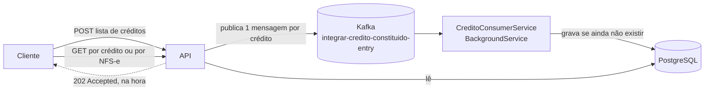
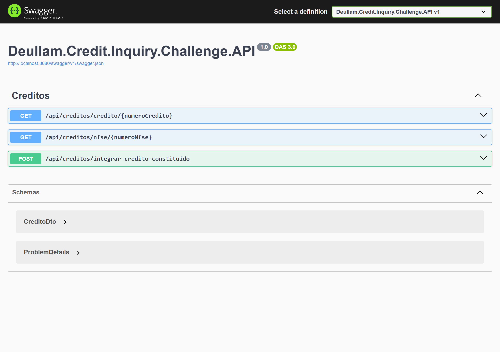
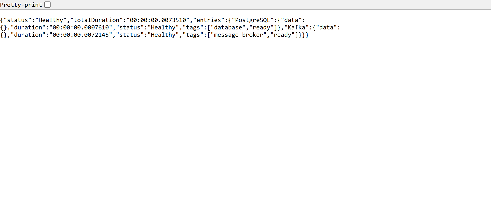
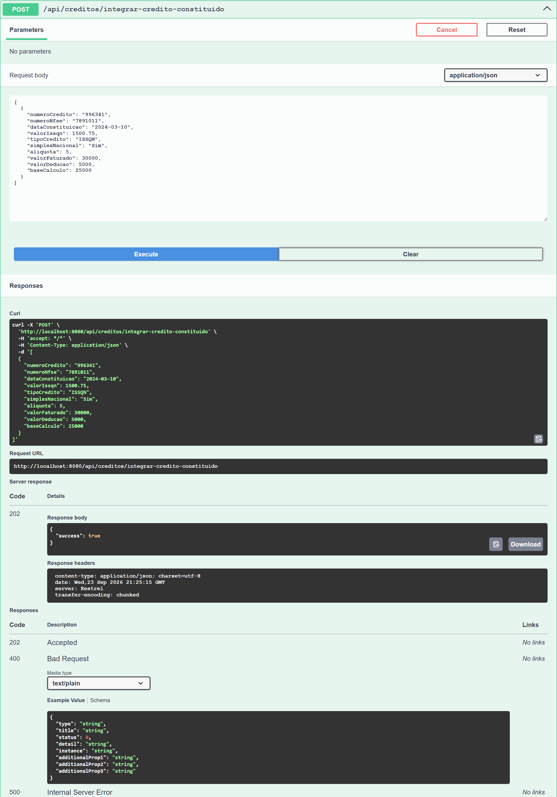
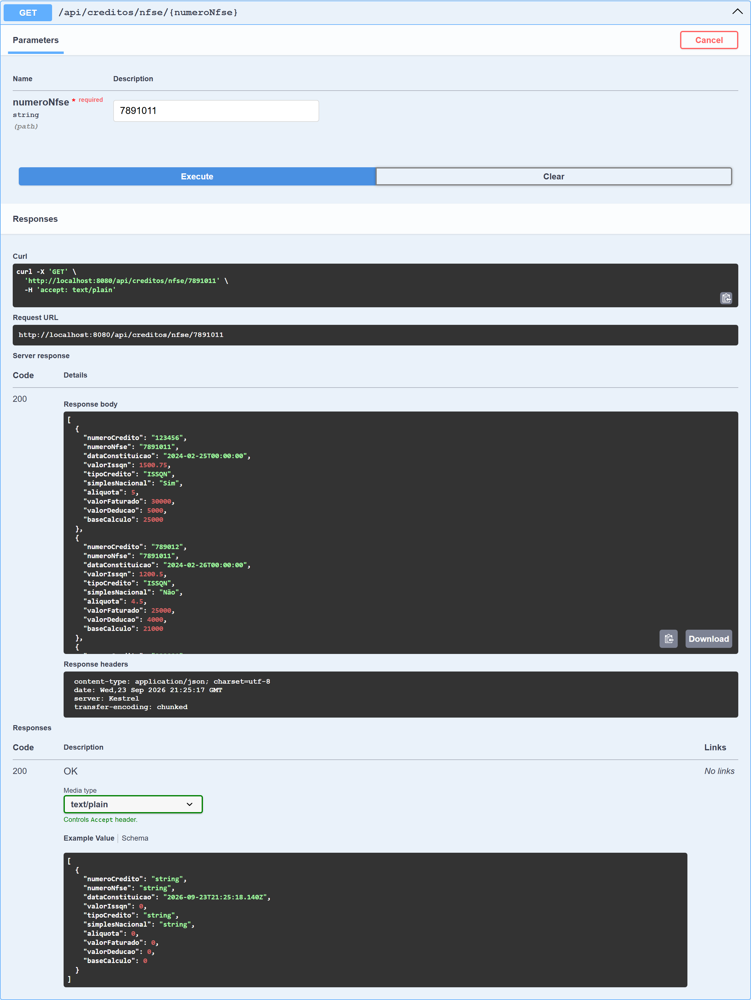

<div align="center">

# Desafio Técnico: API de Consulta de Créditos Constituídos

Serviço de back-end para integrar e consultar créditos tributários constituídos.

</div>

<div align="center">


</div>

---

## Visão geral

A aplicação é uma API REST em .NET 8 organizada em Clean Architecture, com PostgreSQL,
Apache Kafka e Docker Compose. Ela expõe duas operações:

1. **Integração assíncrona de créditos.** Um `POST` recebe uma lista de créditos, publica cada
   um como mensagem em um tópico do Kafka e responde **202 Accepted** na hora, sem esperar a
   gravação. Um `BackgroundService` consome o tópico e persiste os créditos.
2. **Consulta de créditos.** Endpoints `GET` leem do banco os créditos já processados.

Há também endpoints de **health check** para liveness e readiness.

### O que o 202 significa aqui

Esse é o ponto central do desenho e vale entender antes de testar a API: o `POST` confirma o
**enfileiramento**, não a gravação. Logo depois de um `202`, um `GET` do mesmo crédito ainda
responde `404` — ele só aparece quando o consumidor processar a mensagem. Em consequência:

- a recusa de duplicados (`ConflictException`) acontece **no consumidor**, ao processar a
  mensagem, e por isso nunca vira um `409` na resposta do `POST`;
- o `POST` só responde `400` para o que dá para julgar na borda: lista nula ou vazia e corpo
  que não desserializa no `CreditoDto` (campos obrigatórios ausentes, tipos errados).

## Arquitetura



Entre o `202` e a gravação existe uma janela: nela, o `GET` do mesmo crédito responde `404`.
É por isso que a recusa de duplicado acontece no consumidor, e não na resposta do `POST`.

- **Domain** — entidade `Credito`, exceções de negócio e a interface do repositório. Não
  depende de nenhuma outra camada da solução.
- **Application** — `CreditoService`, DTOs, validadores e as abstrações de serviços externos
  (`IMessagePublisher`). Depende apenas de Domain.
- **Infra / Infra.Data** — implementações: `KafkaPublisher` (Confluent.Kafka), `AppDbContext`,
  `CreditoRepository` e as migrations do EF Core.
- **IoC** — registro das dependências das camadas acima.
- **API** — controllers, middleware de exceção, health checks, o `CreditoConsumerService` e o
  `Dockerfile`.

O Kafka no meio do caminho de escrita desacopla a API da persistência: a API absorve picos sem
empurrá-los para o banco e responde rápido.

## Tecnologias

| Item | Versão / biblioteca |
| :--- | :--- |
| Framework | .NET 8 (C# 12) |
| Banco de dados | PostgreSQL 15 |
| ORM | Entity Framework Core 8 |
| Mensageria | Apache Kafka (`Confluent.Kafka`) |
| Containerização | Docker + Docker Compose v2 |
| Validação | FluentValidation |
| Mapeamento | AutoMapper |
| Documentação | Swagger / OpenAPI (Swashbuckle) |
| Testes | NUnit, FluentAssertions, Moq, Testcontainers |

---

## Como executar

### Pré-requisitos

| Requisito | Versão | Para quê |
| :--- | :--- | :--- |
| [Docker Desktop](https://www.docker.com/get-started) (ou Docker Engine) | 24+, com Compose v2 | subir API, PostgreSQL, Kafka e pgAdmin |
| [.NET SDK](https://dotnet.microsoft.com/download/dotnet/8.0) | 8.0.401 ou superior | rodar as migrations e os testes no host |
| `make` | GNU Make 4+ | atalhos do `Makefile` (no Windows, via Git Bash ou WSL) |
| Git | qualquer | clonar o repositório |

O `server/global.json` fixa o SDK em 8.0.401 com `rollForward: latestMajor`: se você tiver
apenas o SDK 9 ou 10 instalado, ele é usado sem problema. Os projetos continuam em `net8.0`.

### Sequência que funciona

```bash
# 1. clonar
git clone https://github.com/Deullam/Deullam-Credit-Inquiry-Challenge
cd Deullam-Credit-Inquiry-Challenge/server

# 2. subir o ambiente (cria o .env a partir do .env.example na primeira vez)
make up

# 3. aplicar as migrations no banco do contêiner
make migrate
```

A primeira execução baixa as imagens e compila a API; pode levar alguns minutos.

Não é preciso criar o `.env` à mão: `make up` copia `server/.env.example` para `server/.env` se
ele não existir. O arquivo traz credenciais de desenvolvimento local e é ignorado pelo Git.

`make migrate` roda no host e alcança o PostgreSQL pela porta `5432` publicada pelo compose. O
`dotnet-ef` vem do manifesto local em `server/.config/dotnet-tools.json` — o alvo roda
`dotnet tool restore` antes, então nada é instalado globalmente. Para apontar para outro banco:

```bash
make migrate DB_CONNECTION="Host=localhost;Port=5432;Database=outro;Username=u;Password=p"
```

### Verificando

| O quê | URL |
| :--- | :--- |
| Swagger | <http://localhost:8080/swagger> |
| Readiness (PostgreSQL + Kafka) | <http://localhost:8080/health/ready> |
| Liveness | <http://localhost:8080/health/self> |
| pgAdmin (`admin@admin.com` / `admin`) | <http://localhost:443> |

O Swagger só é exposto em ambiente de desenvolvimento; o `docker-compose.yml` já define
`ASPNETCORE_ENVIRONMENT=Development`. O pgAdmin escuta na porta 443 do contêiner
(`PGADMIN_LISTEN_PORT`), publicada em 443 no host, e serve HTTP puro — daí o `http://`.



O readiness responde com o estado de cada dependência, uma entrada por serviço:



### Encerrando

```bash
make down      # para os contêineres, preserva os dados
make destroy   # para os contêineres e apaga os volumes
```

### Comandos do Makefile

| Comando | Descrição |
| :--- | :--- |
| `make up` | Cria o `.env` se faltar, constrói as imagens se necessário e sobe todos os serviços em segundo plano. |
| `make migrate` | Aplica as migrations do EF Core ao banco. Requer o banco no ar. |
| `make test` | Roda os testes unitários e de integração (exclui a suíte E2E). |
| `make test-e2e` | Roda a suíte E2E contra a pilha real. Requer `make up` e `make migrate`. |
| `make logs` | Exibe os logs de todos os serviços em tempo real. |
| `make build` | Reconstrói as imagens sem cache. |
| `make start` | `up` seguido de `logs`. |
| `make down` | Para os contêineres, mantendo os volumes. |
| `make destroy` | Para os contêineres e remove os volumes de dados. |
| `make help` | Lista os comandos disponíveis. |

---

## Testes

```bash
cd server
dotnet test Deullam.Credit.Inquiry.Challenge.sln --filter "TestCategory!=E2E"     # ou: make test
```

São cinco projetos com sufixo `.Tests`. Quatro têm testes, todos em **NUnit** com **FluentAssertions**; o quinto, `...Common.Tests`, é só a biblioteca de ObjectMothers compartilhada pelos outros e não contém teste algum. O filtro acima deixa de fora a suíte E2E, que exige a pilha do `docker-compose` no ar (ver [Testes E2E contra a pilha real](#testes-e2e-contra-a-pilha-real)):

| Projeto | Cobre |
| :--- | :--- |
| `...Domain.Tests` | criação da entidade `Credito` com dados válidos. |
| `...Application.Tests` | `CreditoService` com repositório em `Moq`: consulta, ausência de registro, duplicidade e validação. |
| `...Integration.Tests` | a API inteira, via `WebApplicationFactory`. |
| `...E2E.Tests` | a pilha real do `docker-compose`, por HTTP e Kafka puros, sem dublê. |

### O que a suíte de integração cobre, e com que dublês

A API sobe inteira em memória com `WebApplicationFactory<Program>`. Pipeline HTTP, middleware de
exceção, controllers, AutoMapper, repositórios e EF Core são o código de
produção, sem alteração. A validação do FluentValidation (`CreditoDtoValidator`) existe, mas hoje
nenhum caminho HTTP a exercita: na borda vale a validação automática do `[ApiController]` sobre os
campos `required` do `CreditoDto`. Só há **dois dublês**, ambos para não precisar de um broker real:

- **Produtor Kafka** — a abstração `IMessagePublisher`, implementada em produção por
  `KafkaPublisher`, é substituída por um `FakeMessagePublisher` que guarda tópico e payload de
  cada mensagem. É o que permite afirmar o que a API publicaria.
- **Consumidor** — o `CreditoConsumerService` não é iniciado, já que não há tópico para escutar.
  O teste do ciclo completo reprocessa a mensagem capturada chamando o mesmo
  `ICreditoService.CreateIfNotExistsAsync` que o `BackgroundService` chama, em um escopo de DI
  próprio. Ou seja: o passo de processamento é o de produção, o laço de consumo do Kafka não é
  exercitado.

O banco depende do que a máquina tem:

- **com Docker** (`docker info` responde): um PostgreSQL 15 descartável via **Testcontainers**,
  com o schema criado pelas **migrations reais** do EF Core;
- **sem Docker**: um arquivo **SQLite** temporário, com o schema criado a partir do modelo
  (`EnsureCreated`). *Limitação conhecida:* nesse modo as migrations do Npgsql não são
  exercitadas e o health check de PostgreSQL não tem servidor para consultar. O restante da
  cobertura — HTTP, desserialização, mensageria e persistência — continua valendo.

Os oito testes são independentes entre si: cada um usa seu próprio número de crédito e nenhum
depende da ordem de execução.

| Teste | Afirma |
| :--- | :--- |
| `Post_ComListaValida_...` | `202` e exatamente uma mensagem publicada, no tópico e com o payload esperados. |
| `Post_ComListaVazia_...` | `400` e nenhuma mensagem publicada. |
| `Post_ComCampoObrigatorioAusente_...` | `400` com os erros de validação e nenhuma mensagem publicada. |
| `Get_ComNumeroCreditoInexistente_...` | `404`. |
| `Get_AposOConsumidorProcessarAMensagem_...` | `404` logo após o `202` e `200` com o registro depois do processamento. |
| `Get_PorNumeroNfse_...` | a consulta por NFS-e devolve os créditos daquela nota. |
| `HealthSelf_...` | `/health/self` responde `Healthy`. |
| `HealthReady_...` | `/health/ready` responde e reporta PostgreSQL e Kafka. |

`/health/ready` sai degradado na suíte de propósito: o host de teste não tem broker Kafka, então
o teste afirma o que vale nos dois casos — que o endpoint está mapeado e cobre as duas
dependências críticas.

### Testes E2E contra a pilha real

A suíte `...E2E.Tests` não tem dublê nenhum: fala HTTP puro com a API publicada pelo compose
(`http://localhost:8080`) e Confluent.Kafka puro com o broker (`localhost:29092`, listener
`PLAINTEXT_HOST`). É a única que exercita o `CreditoConsumerService` de verdade — a mensagem
atravessa o Kafka real e quem grava no PostgreSQL é o consumidor rodando dentro do contêiner da API.

```bash
cd server
make up        # sobe API, PostgreSQL, Kafka e pgAdmin
make migrate   # aplica as migrations (o seed da NFS-e 7891011 é pré-requisito de um dos cenários)
make test-e2e  # = dotnet test Deullam.Credit.Inquiry.Challenge.E2E.Tests
make down
```

Antes do primeiro teste, a suíte espera `/health/ready` responder `200` por até 90 s; se não
responder, falha com a instrução de rodar `make up` + `make migrate` — nunca passa em silêncio sem
a pilha. Dois ajustes por variável de ambiente, ambos opcionais: `E2E_API_BASE_URL` (default
`http://localhost:8080`) e `E2E_KAFKA_BOOTSTRAP` (default `localhost:29092`).

O que ela cobre, rastreado pelas categorias `CI-01` a `CI-06` e pelo `[Description]` de cada teste:

| Jornada | Afirma |
| :--- | :--- |
| `CI-01` | `202` no POST; `404` no GET imediato; `200` com todos os campos depois que o consumidor real processa; o crédito aparece na consulta por NFS-e; uma lista com N créditos gera N mensagens no tópico real e cada um fica consultável. |
| `CI-02` | POST inválido (lista nula/vazia, campo obrigatório ausente, tipo incompatível, JSON inválido, objeto em vez de array) responde `400` e **nenhuma mensagem nova chega ao tópico real** — provado por um consumidor Kafka de prova posicionado nos offsets finais do tópico antes de cada POST. |
| `CI-03` | `404` para número de crédito que nunca existiu; `200` com `[]` para NFS-e sem créditos. |
| `CI-04` | Reenviar o mesmo número de crédito responde `202`, não cria segunda linha, não altera o registro original, e um crédito enviado depois continua sendo processado (o consumidor sobrevive à `ConflictException`). |
| `CI-05` | A consulta reflete o seed da migration `AddSeedData`: NFS-e `7891011` com os créditos `123456` (`SimplesNacional = "Sim"`) e `789012` (`"Não"`), campo a campo. |
| `CI-06` | Com tudo no ar, `/health/ready` responde `200 Healthy` com `PostgreSQL` e `Kafka` `Healthy` e `/health/self` responde `200 Healthy` com `entries` vazio. Os cenários com dependência fora do ar ainda não estão cobertos. |

Todos os identificadores gerados levam o prefixo `E2E-<id da execução>`, então a suíte pode rodar
várias vezes contra o mesmo banco sem colidir com o seed nem com execuções anteriores. Os testes
rodam em série de propósito: a prova de "nada foi publicado" do `CI-02` depende de nenhum outro
teste estar publicando ao mesmo tempo.

---

## Documentação da API

Documentação interativa em <http://localhost:8080/swagger>.

### `POST /api/creditos/integrar-credito-constituido`

Enfileira uma lista de créditos para processamento assíncrono.

**Corpo da requisição (`application/json`)**

```json
[
  {
    "numeroCredito": "123456",
    "numeroNfse": "7891011",
    "dataConstituicao": "2024-02-25",
    "valorIssqn": 1500.75,
    "tipoCredito": "ISSQN",
    "simplesNacional": "Sim",
    "aliquota": 5.0,
    "valorFaturado": 30000.00,
    "valorDeducao": 5000.00,
    "baseCalculo": 25000.00
  }
]
```

**Respostas**

| Código | Status | Quando |
| :--- | :--- | :--- |
| `202` | Accepted | As mensagens foram enfileiradas. Não significa que os créditos já estão gravados. |
| `400` | Bad Request | Lista nula ou vazia, ou corpo que não desserializa no `CreditoDto`. |
| `500` | Internal Server Error | Falha ao publicar no Kafka, por exemplo. |



### `GET /api/creditos/credito/{numeroCredito}`

Busca um crédito pelo número do crédito.

| Código | Status | Quando |
| :--- | :--- | :--- |
| `200` | OK | Retorna o crédito. |
| `404` | Not Found | Nenhum crédito com esse número. |
| `503` | Service Unavailable | Falha transitória de banco. |
| `500` | Internal Server Error | Erro inesperado. |

### `GET /api/creditos/nfse/{numeroNfse}`

Lista os créditos de uma NFS-e. Quando não há nenhum, responde `200` com lista vazia — não `404`.

**Resposta (200 OK)**

```json
[
  {
    "numeroCredito": "123456",
    "numeroNfse": "7891011",
    "dataConstituicao": "2024-02-25T00:00:00",
    "valorIssqn": 1500.75,
    "tipoCredito": "ISSQN",
    "simplesNacional": "Sim",
    "aliquota": 5.0,
    "valorFaturado": 30000.00,
    "valorDeducao": 5000.00,
    "baseCalculo": 25000.00
  }
]
```

| Código | Status | Quando |
| :--- | :--- | :--- |
| `200` | OK | Lista de créditos da NFS-e, possivelmente vazia. |
| `503` | Service Unavailable | Falha transitória de banco. |
| `500` | Internal Server Error | Erro inesperado. |



### Monitoramento

#### `GET /health/self`

Liveness: a aplicação está no ar. Não consulta dependência nenhuma.

```json
{
  "status": "Healthy",
  "totalDuration": "00:00:00.0015486",
  "entries": {}
}
```

#### `GET /health/ready`

Readiness: a aplicação está pronta para receber tráfego, com o estado de cada dependência
crítica.

```json
{
  "status": "Healthy",
  "totalDuration": "00:00:00.0543012",
  "entries": {
    "PostgreSQL": {
      "status": "Healthy",
      "duration": "00:00:00.0123456"
    },
    "Kafka": {
      "status": "Healthy",
      "duration": "00:00:00.0423456"
    }
  }
}
```

Responde `503` quando alguma dependência está indisponível.

---

## Limitações conhecidas

Este é um desafio técnico, não um serviço em produção. O que está fora de escopo, de propósito
ou por dívida assumida:

- **Sem autenticação e sem autorização.** As três rotas são abertas. Não há conceito de usuário,
  cliente ou tenant em lugar nenhum do código.
- **A validação semântica não roda em nenhum caminho HTTP.** O `CreditoDtoValidator`
  (FluentValidation) só é chamado por `CreditoService.IntegrarCreditosAsync`, e nenhum caminho da
  API invoca esse método: o controller publica no Kafka e o consumidor chama
  `CreateIfNotExistsAsync`. Na prática, um crédito com `valorIssqn` negativo é aceito e gravado.
  A validação de borda que existe é a automática do `[ApiController]` sobre os campos
  obrigatórios do `CreditoDto`. Corrigir isso é decidir onde validar — antes de enfileirar ou no
  consumidor antes de gravar — e muda comportamento, então ficou registrado em vez de remendado.
- **Sem integração contínua.** Não há workflow do GitHub Actions: build, testes e a suíte E2E
  rodam na máquina de quem clona.
- **Sem retentativa nem dead-letter no consumidor.** Uma mensagem que falhe ao gravar por motivo
  transitório não volta para a fila nem vai para um tópico de descarte.
- **Sem observabilidade além dos health checks.** Não há métricas, tracing distribuído nem log
  estruturado com correlação por requisição.
- **Um único ambiente.** O `docker-compose.yml` serve desenvolvimento local; não há manifesto de
  produção, e as credenciais do `.env.example` são de desenvolvimento.
- **`AutoMapper 12.0.1` tem vulnerabilidade conhecida (NU1903)** e continua fixado por
  compatibilidade; atualizar é item pendente.

---

<div align="center">
<h2>Desenvolvido por Deullam Justi</h2>
</div>
